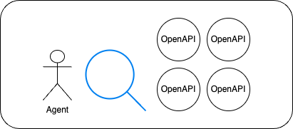

OpenAPI-Search combines multiple OpenAPIs in a fast, organized, and searchable interface.

OpenAPIs are effectively closed if there isn't an accessible way to find and use them. Big commercial API directories such as https://rapidapi.com are currently dominating the search results and the # of APIs indexed, leading many developers to a non-open API gateway. Open Source is far behind.

The best OpenAPI directory as of yet is https://apis.guru but this doesn't even reach 10% of the amount of listed APIs and there is many room for improvement.

The vision of https://openapisearch.com is to make OpenAPIs truly open by making it accessible (easy to find what you're looking for) and improving listing quality.

Related work: https://github.com/janwilmake/oapis and https://github.com/janwilmake/oapis.npm and https://github.com/janwilmake/openapi-mcp-server

# Goals

Targeted improvements compared to https://apis.guru:

- Easy navigation for agents
- Programmatic Registry
- Improved Website

# Wishlist:

- E2E Testing of OpenAPIs
- AI Crawler for API Discovery
- AI Crawler to augment OpenAPI Metadata
  - Adds authentication + scope info
  - Adds useful links
  - Adds reviews
  - Adds pricing info, ratelimit info, etc

## Non-goals

- Create a docs reference website like [readme.com](https://readme.com) (there are many) - for this we're using stoplight now.
- Add weird custom logic that is non-standard to the OpenAPI. Instead, I aim to create a layer on top of openapis to improve the implementation of the standard. I'll use [actionschema](https://actionschema.com) for this.

# Changelog

- **2025-03-20** - I did lots of work in this area and left it all behind after moving to cloudflare. It's time to take some of this work and redo it with a new vision, taking in all learnings from the last months. My current intuition is as follows; 1) Don't focus on quantity, focus on quality of a few great OpenAPIs. Make it very easy to build with a particular OpenAPI, for example. 2) People want to see their own OpenAPIs, and aren't interested in 99% of all other OpenAPIs.
- **2025-03-23** - https://xymake.com/janwilmake/status/1903879996592242987.html
- **2025-03-29** - improved landingpage - https://xymake.com/janwilmake/status/1905974796426629437.html
- **2025-08-08** - improved landingpage, UX and incentivization of explorability (https://x.com/janwilmake/status/1953798491651633647)

# On Agent-readiness for API products

1. Make your OpenAPI super good.

Your OpenAPI is your source of truth. Common pitfalls include:

- Missing `operationId`, `summary` and/or `description` in your operations (summary should be up to 1 sentence, description up to a paragraph)
- Unclear or vague `operationId`, `summary`, or `description`. What matters is clarity to token ratio (a.k.a. signal to noise ratio)
- Missing `servers[0].url` field.
- Missing authentication options.
- Not referencing `externalDocs.url`. Almost nobody uses this. If you do, please ensure the url provided responds with markdown by default when accessed via `curl {url}`. When browsers access it, it's fine to respond with html.

A good OpenAPI specification should allow an agent to navigate the entirety of your APIs and should be easily navigatable. To make the API more navigatable, I have developed [openapi-for-llms](https://github.com/janwilmake/openapisearch/tree/main/packages/openapi-for-llms) which collapses your OpenAPI spec into a [llms.txt](https://llmstxt.org) compatible file that can be exposed on the web or in your repo. To make this file high-quality, it's important to provide a high-level overview to the APIs on how to use them. This can either be placed in `info.description` or as part of your `tags[n].description` fields. Tags will be leveraged to structure your llms.txt better, grouping the APIs per tag.

2. Make your OpenAPI discoverable.

Unfortunately there has not been any conclusion on how OAS wants to be made discoverable still, but discussions have been plentiful. The easiest way to do make it discoverable, is redirecting to your `openapi.json` file from https://yourlanding.com/.well-known/openapi. Besides that, it's good practice to put your `openapi.json` at the root of your api tld. Read more in [openapi-discovery](openapi-discovery.md)

3. Have all your APIs documented in a single OpenAPI file

Some large APIs have different files for different parts of their API. In that case, it's best to merge it in some way, for example with [redocly](https://redocly.com/blog/combining-openapis)
